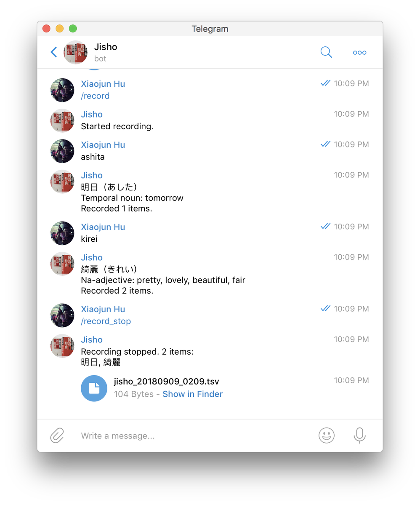
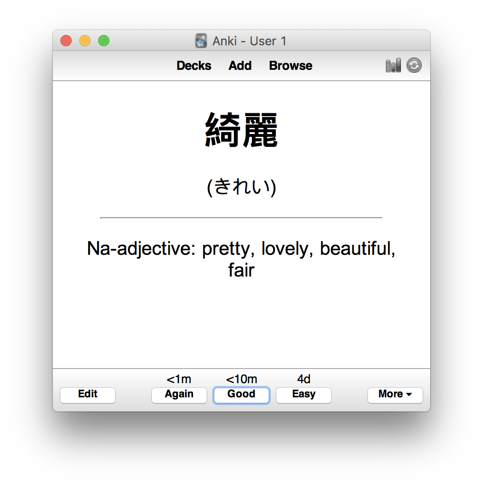

# jisho-bot

jisho-bot offers basic Japanese-English dictionary over Telegram bot ([@my_jisho_bot](https://t.me/my_jisho_bot)). It also supports exporting your lookup history into flashcards.

## Installation

- python >= 3.5
- `pip install -r requirements.txt`
- ```zsh
  mv jisho/config.py.example jisho/config.py
  # Put your Telegram bot token here
  vim jisho/config.py
  # Run the bot
  python jisho/jisho.py
  ```

## Usage

### Lookup a word

- Just message `<word>` to the bot, or use `/search <word>` in group chats.

### Export flashcards

- Message `/record` to start recording.
- Lookup words.
- Message `/record_stop` to stop recording, a TSV file with definitions of the words will be sent to you.



#### Importing flashcards into Anki

[Anki](https://wzyboy.im/post/1223.html) is a powerful, cross-platform flashcard app. You can import the TSV file that jisho-bot generated into Anki.

The exported TSV has three fields:
- `{word}   {reading}   {definition}`
- `reading` is usually Hiragana, or Katakana for loanwords (借用語).

An example of Anki flashcard:


## Credits

jisho-bot uses [jisho.org](http://jisho.org)'s amazing API for Japanese-English dictionary.
